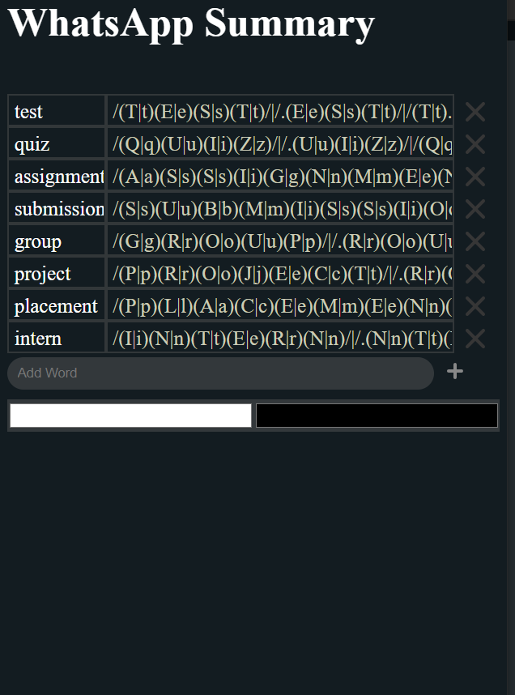

# WhatsApp Summary

### A JS Bookmarklet to highlight messages on whatsapp web that might contain important information. ( Made to help plough through tons of messages containing sparse information. )

The bookmarklet uses a list of search words to generate regular expressions that take into account possible typing mistakes and searches WhatsApp web to highlight possible matches.

### Adding bookmarklet
- Clone repository.
- Open dist/index.html in a browser.
- Drag the button to your bookmarks bar to save it as a bookmarklet.